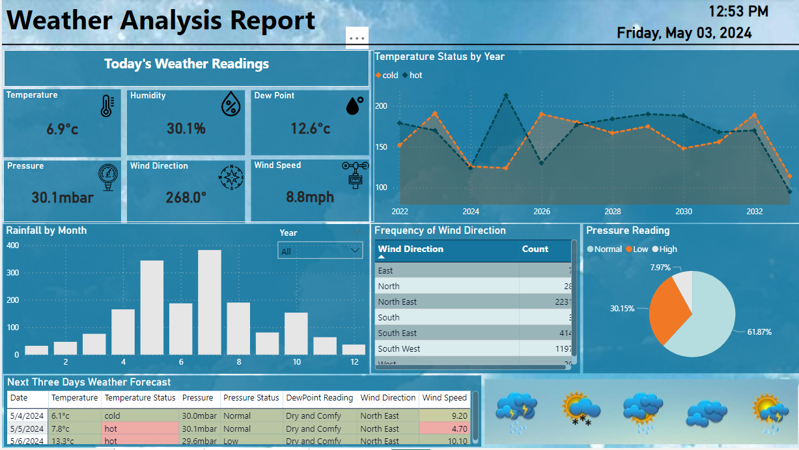
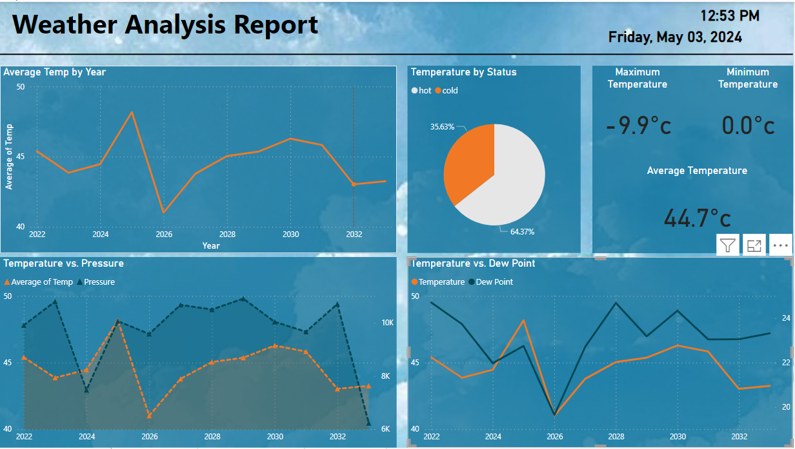
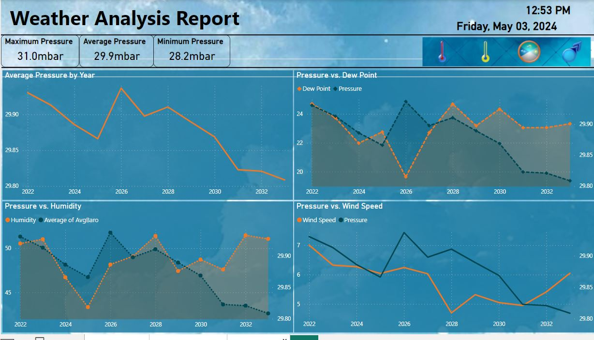

# Weather-Forecasting-Analysis-and-Visualization

## Introduction
This is a  project on Weather Forecast. I teamed up with a group of Data Analyst friends to take part in a competition organized on LinkedIn by HiConselor. We were eager to dive into a robust dataset, aiming to sharpen our skills in data cleaning, analysis, and visualization. 
Weather prediction is crucial information needed everywhere. It includes gathering global meteorological data from both surface and upper air. We analyze pressure, temperature, moisture, and wind globally and frequently to forecast upcoming weather conditions.

## Problem Statement
1. Give the count of the minimum number of days for the time when temperature reduced.
2. Find the temperature as Cold / hot by using the case and avg of values of the given data set.
3. Can you check for all 4 consecutive days when the temperature was below 30 Fahrenheit.
4. Can you find the maximum number of days for which temperature dropped.
5. Can you find the average of average humidity from the dataset (NOTE: should contain the following clauses: group by, order by, date).
6. Use the GROUP BY clause on the Date column and make a query to fetch details for average windspeed.
7. If the maximum gust speed increases from 55mph, fetch the details for the next 4 days.
8. Find the number of days when the temperature went below 0 degrees Celsius.
9. Create another table with a “Foreign key” relation with the existing given data set.

## Data Cleaning Tasks
Each of the following data cleaning tasks were carried out on the data using SQL:
-Task 1: Correct years for given data set
-Task 2: removal of duplicate rows and duplicate columns
-Task 3: fix a few labels in the given data set
-Task 4: encoding data into suitable format

## Skills/ Concept Demostrated
The folowing are Power BI features were incorporated:
- DAX
- Quick measure
- Filters
  
The folowing are Power SQL features were incorporated:
- Data Manipulation
- Data Filtering and Sorting
- Data Aggregation
- Subqueries
- Data Constraints

## Visualization
1. Overview
2. Temperature
3. Pressure
The following are the
### Overview: 

### Temperature:

### Pressure:

## Solutions
View the Data Cleaning scripts: [Here](Data Cleaning Script.sql)
View the clean dataset: [Here](Clean Date.csv)
View the Solution scripts: [Here](Solution Script.sql)
